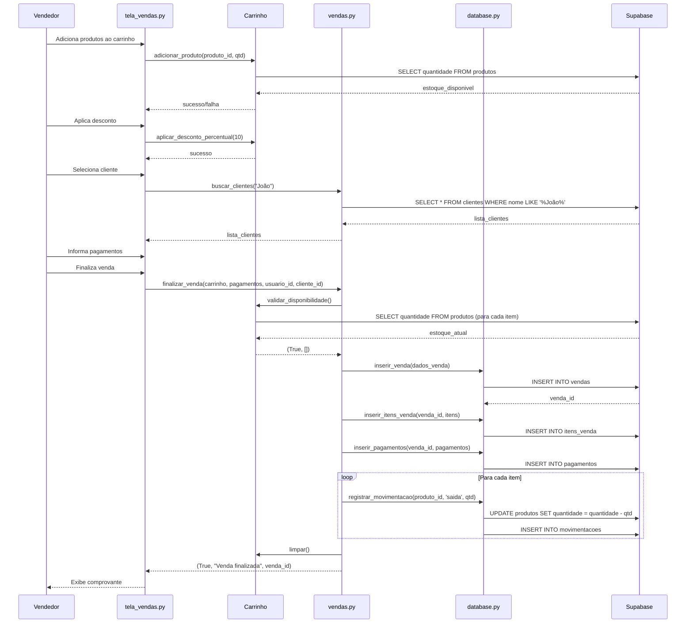
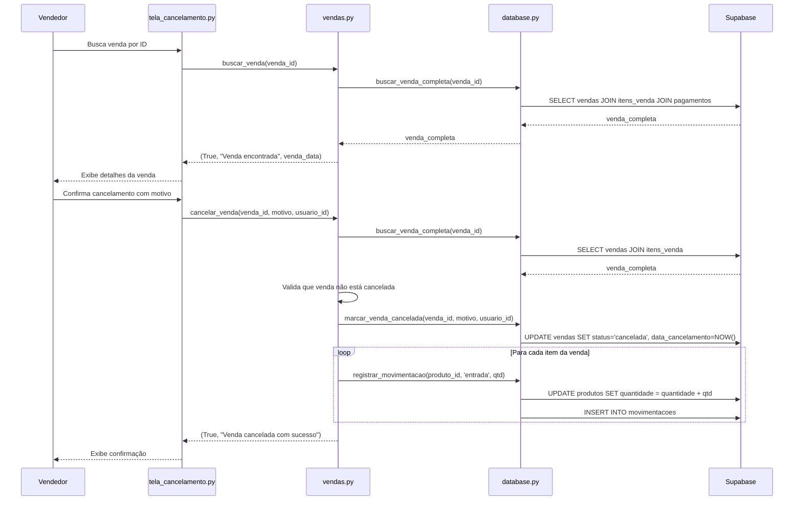
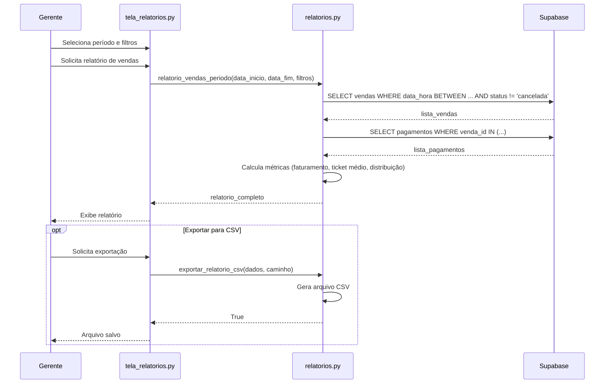

# Documentação Técnica - Sistema de Vendas DEKIDS

**Versão**: 1.0  
**Data**: 2025-01-23  
**Autor**: Equipe de Desenvolvimento DEKIDS

---

## Índice

1. [Visão Geral](#visão-geral)
2. [Arquitetura do Sistema](#arquitetura-do-sistema)
3. [Estrutura de Banco de Dados](#estrutura-de-banco-de-dados)
4. [APIs dos Módulos](#apis-dos-módulos)
5. [Integração com Sistema de Estoque](#integração-com-sistema-de-estoque)
6. [Fluxos de Dados](#fluxos-de-dados)
7. [Tratamento de Erros](#tratamento-de-erros)
8. [Guia de Desenvolvimento](#guia-de-desenvolvimento)

---

## 1. Visão Geral

O Sistema de Vendas DEKIDS é um módulo integrado ao sistema de estoque existente que permite:

- **Registro de vendas** com baixa automática de estoque
- **Gestão de clientes** com histórico de compras
- **Processamento de pagamentos** múltiplos (dinheiro, cartão, PIX)
- **Geração de comprovantes** em PDF
- **Cancelamento de vendas** com estorno de estoque
- **Relatórios gerenciais** de vendas, produtos e vendedores

### Tecnologias Utilizadas

- **Linguagem**: Python 3.10+
- **Interface**: Flet 0.23.2
- **Banco de Dados**: Supabase (PostgreSQL)
- **Bibliotecas**: reportlab (PDF), hypothesis (testes)

---

## 2. Arquitetura do Sistema

### 2.1 Estrutura de Módulos

```
sistema-vendas/
├── vendas.py              # Lógica de carrinho e vendas
├── clientes.py            # Gestão de clientes
├── validacao_vendas.py    # Validações de dados
├── relatorios.py          # Geração de relatórios
├── database.py            # Camada de acesso a dados (estendida)
├── tela_vendas.py         # Interface de vendas
├── tela_clientes.py       # Interface de clientes
├── tela_relatorios.py     # Interface de relatórios
└── tela_cancelamento.py   # Interface de cancelamento
```

### 2.2 Camadas da Aplicação

```
┌─────────────────────────────────────┐
│     Camada de Apresentação          │
│  (Flet UI - tela_*.py)              │
└─────────────────────────────────────┘
              ↓
┌─────────────────────────────────────┐
│     Camada de Negócio               │
│  (vendas.py, clientes.py,           │
│   validacao_vendas.py, relatorios.py)│
└─────────────────────────────────────┘
              ↓
┌─────────────────────────────────────┐
│     Camada de Dados                 │
│  (database.py)                      │
└─────────────────────────────────────┘
              ↓
┌─────────────────────────────────────┐
│     Banco de Dados                  │
│  (Supabase PostgreSQL)              │
└─────────────────────────────────────┘
```


---

## 3. Estrutura de Banco de Dados

### 3.1 Diagrama de Relacionamentos

```
┌──────────────┐       ┌──────────────┐       ┌──────────────┐
│   CLIENTES   │       │    VENDAS    │       │   USUARIOS   │
│──────────────│       │──────────────│       │──────────────│
│ id (PK)      │◄──────│ id (PK)      │◄──────│ id (PK)      │
│ nome         │       │ data_hora    │       │ username     │
│ cpf (UK)     │       │ valor_total  │       │ senha_hash   │
│ telefone     │       │ desconto_*   │       │ ...          │
│ email        │       │ valor_final  │       └──────────────┘
│ endereco_*   │       │ cliente_id   │
│ created_at   │       │ usuario_id   │
└──────────────┘       │ status       │
                       │ data_cancel  │
                       │ motivo_cancel│
                       └──────────────┘
                              │
                    ┌─────────┴─────────┐
                    │                   │
            ┌───────▼────────┐  ┌──────▼────────┐
            │ ITENS_VENDA    │  │  PAGAMENTOS   │
            │────────────────│  │───────────────│
            │ id (PK)        │  │ id (PK)       │
            │ venda_id (FK)  │  │ venda_id (FK) │
            │ produto_id (FK)│  │ forma_pag     │
            │ quantidade     │  │ valor         │
            │ preco_unitario │  │ num_parcelas  │
            │ subtotal       │  │ valor_recebido│
            └────────────────┘  │ troco         │
                    │           └───────────────┘
                    │
            ┌───────▼────────┐
            │   PRODUTOS     │
            │────────────────│
            │ id (PK)        │
            │ descricao      │
            │ marca          │
            │ referencia     │
            │ quantidade     │
            │ preco          │
            └────────────────┘
```

### 3.2 Tabela: clientes

Armazena informações de clientes cadastrados no sistema.

```sql
CREATE TABLE clientes (
    id BIGSERIAL PRIMARY KEY,
    nome VARCHAR(255) NOT NULL,
    cpf VARCHAR(11) NOT NULL UNIQUE,
    telefone VARCHAR(20),
    email VARCHAR(255),
    endereco_rua VARCHAR(255),
    endereco_numero VARCHAR(20),
    endereco_complemento VARCHAR(100),
    endereco_bairro VARCHAR(100),
    endereco_cidade VARCHAR(100),
    endereco_estado VARCHAR(2),
    endereco_cep VARCHAR(8),
    created_at TIMESTAMP WITH TIME ZONE DEFAULT NOW()
);

CREATE INDEX idx_clientes_cpf ON clientes(cpf);
CREATE INDEX idx_clientes_nome ON clientes(nome);
CREATE INDEX idx_clientes_telefone ON clientes(telefone);
```

**Campos**:
- `id`: Identificador único do cliente
- `nome`: Nome completo do cliente
- `cpf`: CPF sem formatação (11 dígitos)
- `telefone`: Telefone de contato
- `email`: Email do cliente
- `endereco_*`: Campos de endereço completo
- `created_at`: Data/hora de cadastro

**Constraints**:
- CPF deve ser único no sistema
- CPF deve ter exatamente 11 dígitos numéricos
- Email deve ter formato válido (validado na aplicação)


### 3.3 Tabela: vendas

Armazena o cabeçalho de cada venda realizada.

```sql
CREATE TABLE vendas (
    id BIGSERIAL PRIMARY KEY,
    data_hora TIMESTAMP WITH TIME ZONE DEFAULT NOW(),
    valor_total DECIMAL(10, 2) NOT NULL,
    desconto_percentual DECIMAL(5, 2) DEFAULT 0,
    desconto_valor DECIMAL(10, 2) DEFAULT 0,
    valor_final DECIMAL(10, 2) NOT NULL,
    cliente_id BIGINT REFERENCES clientes(id),
    usuario_id BIGINT NOT NULL REFERENCES usuarios(id),
    status VARCHAR(20) NOT NULL DEFAULT 'finalizada',
    data_cancelamento TIMESTAMP WITH TIME ZONE,
    motivo_cancelamento TEXT,
    usuario_cancelamento_id BIGINT REFERENCES usuarios(id),
    created_at TIMESTAMP WITH TIME ZONE DEFAULT NOW()
);

CREATE INDEX idx_vendas_data_hora ON vendas(data_hora);
CREATE INDEX idx_vendas_cliente_id ON vendas(cliente_id);
CREATE INDEX idx_vendas_usuario_id ON vendas(usuario_id);
CREATE INDEX idx_vendas_status ON vendas(status);
```

**Campos**:
- `id`: Identificador único da venda
- `data_hora`: Data e hora da venda
- `valor_total`: Valor total antes dos descontos
- `desconto_percentual`: Desconto percentual aplicado (0-100)
- `desconto_valor`: Desconto em valor fixo aplicado
- `valor_final`: Valor final após descontos
- `cliente_id`: ID do cliente (NULL para venda avulsa)
- `usuario_id`: ID do vendedor que realizou a venda
- `status`: Status da venda ('finalizada' ou 'cancelada')
- `data_cancelamento`: Data/hora do cancelamento (se aplicável)
- `motivo_cancelamento`: Motivo do cancelamento
- `usuario_cancelamento_id`: ID do usuário que cancelou

**Constraints**:
- `status` IN ('finalizada', 'cancelada')
- `valor_final` = `valor_total` - `desconto_valor` - (`valor_total` * `desconto_percentual` / 100)
- Se `status` = 'cancelada', então `data_cancelamento` NOT NULL

### 3.4 Tabela: itens_venda

Armazena os itens (produtos) de cada venda.

```sql
CREATE TABLE itens_venda (
    id BIGSERIAL PRIMARY KEY,
    venda_id BIGINT NOT NULL REFERENCES vendas(id) ON DELETE CASCADE,
    produto_id BIGINT NOT NULL REFERENCES produtos(id),
    quantidade INTEGER NOT NULL,
    preco_unitario DECIMAL(10, 2) NOT NULL,
    subtotal DECIMAL(10, 2) NOT NULL,
    created_at TIMESTAMP WITH TIME ZONE DEFAULT NOW()
);

CREATE INDEX idx_itens_venda_venda_id ON itens_venda(venda_id);
CREATE INDEX idx_itens_venda_produto_id ON itens_venda(produto_id);
```

**Campos**:
- `id`: Identificador único do item
- `venda_id`: ID da venda (FK)
- `produto_id`: ID do produto (FK)
- `quantidade`: Quantidade vendida
- `preco_unitario`: Preço unitário no momento da venda
- `subtotal`: Subtotal do item (quantidade × preço_unitario)

**Constraints**:
- `quantidade` > 0
- `preco_unitario` > 0
- `subtotal` = `quantidade` * `preco_unitario`


### 3.5 Tabela: pagamentos

Armazena as formas de pagamento utilizadas em cada venda.

```sql
CREATE TABLE pagamentos (
    id BIGSERIAL PRIMARY KEY,
    venda_id BIGINT NOT NULL REFERENCES vendas(id) ON DELETE CASCADE,
    forma_pagamento VARCHAR(20) NOT NULL,
    valor DECIMAL(10, 2) NOT NULL,
    numero_parcelas INTEGER,
    valor_recebido DECIMAL(10, 2),
    troco DECIMAL(10, 2),
    created_at TIMESTAMP WITH TIME ZONE DEFAULT NOW()
);

CREATE INDEX idx_pagamentos_venda_id ON pagamentos(venda_id);
CREATE INDEX idx_pagamentos_forma_pagamento ON pagamentos(forma_pagamento);
```

**Campos**:
- `id`: Identificador único do pagamento
- `venda_id`: ID da venda (FK)
- `forma_pagamento`: Tipo de pagamento
- `valor`: Valor pago nesta forma
- `numero_parcelas`: Número de parcelas (apenas cartão de crédito)
- `valor_recebido`: Valor recebido (apenas dinheiro)
- `troco`: Troco devolvido (apenas dinheiro)

**Formas de Pagamento**:
- `dinheiro`: Pagamento em dinheiro
- `cartao_credito`: Cartão de crédito (1-12 parcelas)
- `cartao_debito`: Cartão de débito (à vista)
- `pix`: Pagamento via PIX (à vista)

**Constraints**:
- `forma_pagamento` IN ('dinheiro', 'cartao_credito', 'cartao_debito', 'pix')
- Se `forma_pagamento` = 'cartao_credito', então `numero_parcelas` BETWEEN 1 AND 12
- Se `forma_pagamento` = 'dinheiro', então `valor_recebido` >= `valor` AND `troco` = `valor_recebido` - `valor`
- Soma de `valor` de todos pagamentos de uma venda = `valor_final` da venda

---

## 4. APIs dos Módulos

### 4.1 Módulo: vendas.py

Gerencia o carrinho de compras e operações de vendas.

#### Classe: ItemCarrinho

Representa um item no carrinho de compras.

```python
@dataclass
class ItemCarrinho:
    produto_id: int           # ID do produto
    descricao: str            # Descrição do produto
    quantidade: int           # Quantidade no carrinho
    preco_unitario: float     # Preço unitário
    estoque_disponivel: int   # Estoque disponível
    
    def calcular_subtotal(self) -> float:
        """Retorna quantidade × preço_unitario"""
```

#### Classe: Carrinho

Gerencia o carrinho de compras temporário.

```python
class Carrinho:
    def __init__(self):
        """Inicializa carrinho vazio"""
        self.itens: List[ItemCarrinho] = []
        self.desconto_percentual: float = 0.0
        self.desconto_valor: float = 0.0
```

**Métodos**:

```python
def adicionar_produto(self, produto_id: int, quantidade: int = 1) -> bool
```
- **Descrição**: Adiciona produto ao carrinho ou incrementa quantidade se já existir
- **Parâmetros**:
  - `produto_id`: ID do produto
  - `quantidade`: Quantidade a adicionar (padrão: 1)
- **Retorno**: `True` se sucesso, `False` se estoque insuficiente ou produto não encontrado
- **Validações**: Verifica disponibilidade de estoque antes de adicionar


```python
def remover_produto(self, produto_id: int) -> bool
```
- **Descrição**: Remove produto do carrinho
- **Parâmetros**: `produto_id` - ID do produto a remover
- **Retorno**: `True` se removido, `False` se não encontrado

```python
def atualizar_quantidade(self, produto_id: int, quantidade: int) -> bool
```
- **Descrição**: Atualiza quantidade de um produto no carrinho
- **Parâmetros**:
  - `produto_id`: ID do produto
  - `quantidade`: Nova quantidade desejada
- **Retorno**: `True` se atualizado, `False` se estoque insuficiente ou produto não encontrado
- **Validações**: Verifica disponibilidade de estoque

```python
def aplicar_desconto_percentual(self, percentual: float) -> bool
```
- **Descrição**: Aplica desconto percentual ao carrinho
- **Parâmetros**: `percentual` - Percentual de desconto (0-100)
- **Retorno**: `True` se aplicado, `False` se percentual inválido
- **Validações**: Percentual entre 0 e 100, não resulta em valor negativo

```python
def aplicar_desconto_valor(self, valor: float) -> bool
```
- **Descrição**: Aplica desconto em valor fixo ao carrinho
- **Parâmetros**: `valor` - Valor fixo de desconto
- **Retorno**: `True` se aplicado, `False` se valor inválido
- **Validações**: Valor não excede total do carrinho

```python
def remover_desconto(self) -> None
```
- **Descrição**: Remove todos os descontos aplicados

```python
def calcular_subtotal(self) -> float
```
- **Descrição**: Calcula subtotal do carrinho (soma dos itens)
- **Retorno**: Subtotal antes de descontos

```python
def calcular_desconto(self) -> float
```
- **Descrição**: Calcula valor do desconto aplicado
- **Retorno**: Valor do desconto

```python
def calcular_total(self) -> float
```
- **Descrição**: Calcula total final (subtotal - desconto)
- **Retorno**: Valor total final (nunca negativo)

```python
def limpar(self) -> None
```
- **Descrição**: Limpa carrinho removendo todos os itens e descontos

```python
def validar_disponibilidade(self) -> Tuple[bool, List[str]]
```
- **Descrição**: Valida disponibilidade de estoque para todos os itens
- **Retorno**: Tupla (disponível, mensagens_erro)
  - `disponível`: `True` se todos os itens têm estoque
  - `mensagens_erro`: Lista de mensagens para itens com estoque insuficiente


#### Funções do Módulo vendas.py

```python
def buscar_produtos_venda(termo: str, apenas_disponiveis: bool = True) -> List[Dict]
```
- **Descrição**: Busca produtos por código de barras, referência ou descrição
- **Parâmetros**:
  - `termo`: Termo de busca
  - `apenas_disponiveis`: Se `True`, retorna apenas produtos com estoque > 0
- **Retorno**: Lista de produtos encontrados
- **Busca**: Case-insensitive e parcial em múltiplos campos

```python
def finalizar_venda(
    carrinho: Carrinho,
    pagamentos: List[Dict],
    usuario_id: int,
    cliente_id: Optional[int] = None
) -> Tuple[bool, str, Optional[int]]
```
- **Descrição**: Finaliza venda com transação atômica
- **Parâmetros**:
  - `carrinho`: Instância do Carrinho com produtos
  - `pagamentos`: Lista de dicionários com dados dos pagamentos
  - `usuario_id`: ID do vendedor
  - `cliente_id`: ID do cliente (None para venda avulsa)
- **Retorno**: Tupla (sucesso, mensagem, venda_id)
- **Processo**:
  1. Valida disponibilidade de estoque
  2. Valida pagamentos
  3. Insere venda no banco
  4. Insere itens e pagamentos
  5. Executa baixa de estoque via `registrar_movimentacao()`
  6. Limpa carrinho
- **Transação**: Operação atômica - falha em qualquer etapa cancela toda a venda

```python
def cancelar_venda(venda_id: int, motivo: str, usuario_id: int) -> Tuple[bool, str]
```
- **Descrição**: Cancela venda e restaura estoque
- **Parâmetros**:
  - `venda_id`: ID da venda a cancelar
  - `motivo`: Motivo do cancelamento
  - `usuario_id`: ID do usuário que está cancelando
- **Retorno**: Tupla (sucesso, mensagem)
- **Processo**:
  1. Busca venda completa
  2. Valida que venda existe e não está cancelada
  3. Marca venda como cancelada
  4. Executa estorno de estoque via `registrar_movimentacao(tipo='entrada')`
- **Transação**: Operação atômica

```python
def gerar_comprovante(venda_id: int) -> Optional[Dict]
```
- **Descrição**: Gera dados estruturados do comprovante
- **Parâmetros**: `venda_id` - ID da venda
- **Retorno**: Dicionário com dados do comprovante ou None se não encontrada
- **Estrutura do Retorno**:
```python
{
    'numero_venda': int,
    'data_hora': str,
    'cliente': {'nome': str, 'cpf': str, 'telefone': str} or None,
    'vendedor': str,
    'itens': [{'descricao': str, 'quantidade': int, 'preco_unitario': float, 'subtotal': float}],
    'subtotal': float,
    'desconto_percentual': float,
    'desconto_valor': float,
    'desconto_total': float,
    'valor_final': float,
    'pagamentos': [{'forma_pagamento': str, 'valor': float, ...}],
    'status': str
}
```

```python
def exportar_comprovante_pdf(venda_id: int, caminho_arquivo: str) -> bool
```
- **Descrição**: Exporta comprovante para arquivo PDF
- **Parâmetros**:
  - `venda_id`: ID da venda
  - `caminho_arquivo`: Caminho completo do arquivo PDF
- **Retorno**: `True` se sucesso, `False` se erro
- **Biblioteca**: Utiliza `reportlab` para geração do PDF


```python
def buscar_venda(venda_id: int) -> Tuple[bool, str, Optional[Dict]]
```
- **Descrição**: Busca venda por ID
- **Parâmetros**: `venda_id` - ID da venda
- **Retorno**: Tupla (sucesso, mensagem, dados_venda)

```python
def listar_vendas(
    data_inicio: Optional[str] = None,
    data_fim: Optional[str] = None,
    usuario_id: Optional[int] = None,
    cliente_id: Optional[int] = None,
    status: Optional[str] = None
) -> Tuple[bool, str, List[Dict]]
```
- **Descrição**: Lista vendas com filtros opcionais
- **Parâmetros**: Todos opcionais para filtrar resultados
- **Retorno**: Tupla (sucesso, mensagem, lista_vendas)
- **Ordenação**: Por data_hora DESC (mais recentes primeiro)

---

### 4.2 Módulo: clientes.py

Gerencia cadastro, busca e histórico de clientes.

```python
def cadastrar_cliente(dados: Dict) -> Tuple[bool, str, Optional[int]]
```
- **Descrição**: Cadastra novo cliente
- **Parâmetros**: `dados` - Dicionário com dados do cliente
  - `nome` (obrigatório)
  - `cpf` (obrigatório, 11 dígitos)
  - `telefone`, `email`, `endereco_*` (opcionais)
- **Retorno**: Tupla (sucesso, mensagem, cliente_id)
- **Validações**:
  - CPF com 11 dígitos e dígitos verificadores válidos
  - CPF não duplicado
  - Email com formato válido

```python
def buscar_clientes(termo: str) -> List[Dict]
```
- **Descrição**: Busca clientes por CPF, nome ou telefone
- **Parâmetros**: `termo` - Termo de busca
- **Retorno**: Lista de clientes encontrados
- **Busca**: Case-insensitive e parcial em múltiplos campos

```python
def obter_cliente(cliente_id: int) -> Optional[Dict]
```
- **Descrição**: Obtém dados completos de um cliente
- **Parâmetros**: `cliente_id` - ID do cliente
- **Retorno**: Dicionário com dados do cliente ou None

```python
def editar_cliente(cliente_id: int, dados: Dict) -> Tuple[bool, str]
```
- **Descrição**: Edita dados de cliente existente
- **Parâmetros**:
  - `cliente_id`: ID do cliente
  - `dados`: Dicionário com campos a atualizar
- **Retorno**: Tupla (sucesso, mensagem)
- **Validações**: Mesmas do cadastro para campos fornecidos

```python
def obter_historico_compras(cliente_id: int) -> Dict
```
- **Descrição**: Obtém histórico completo de compras do cliente
- **Parâmetros**: `cliente_id` - ID do cliente
- **Retorno**: Dicionário com:
  - `vendas`: Lista de vendas ordenadas por data DESC
  - `valor_total_gasto`: Soma de todas as vendas finalizadas
  - `numero_compras`: Contagem de vendas finalizadas
  - `data_ultima_compra`: Data da última compra
  - `produtos_mais_comprados`: Lista de produtos agregados por quantidade


---

### 4.3 Módulo: validacao_vendas.py

Contém funções de validação para dados de vendas.

```python
def validar_cpf(cpf: str) -> Tuple[bool, str]
```
- **Descrição**: Valida formato e dígitos verificadores do CPF
- **Parâmetros**: `cpf` - String com CPF (pode ter formatação)
- **Retorno**: Tupla (válido, mensagem)
- **Validações**:
  - Remove caracteres não numéricos
  - Verifica 11 dígitos
  - Valida dígitos verificadores
  - Rejeita CPFs com todos os dígitos iguais

```python
def validar_email(email: str) -> Tuple[bool, str]
```
- **Descrição**: Valida formato de email
- **Parâmetros**: `email` - String com email
- **Retorno**: Tupla (válido, mensagem)
- **Padrão**: Regex para formato padrão de email

```python
def validar_pagamento(
    forma_pagamento: str,
    valor: float,
    numero_parcelas: Optional[int] = None
) -> Tuple[bool, str]
```
- **Descrição**: Valida dados de um pagamento individual
- **Parâmetros**:
  - `forma_pagamento`: Tipo ('dinheiro', 'cartao_credito', 'cartao_debito', 'pix')
  - `valor`: Valor do pagamento
  - `numero_parcelas`: Número de parcelas (apenas cartão de crédito)
- **Retorno**: Tupla (válido, mensagem)
- **Validações**:
  - Forma de pagamento válida
  - Valor > 0
  - Parcelas entre 1-12 para cartão de crédito
  - Parcelas None para outras formas

```python
def validar_pagamentos_venda(
    pagamentos: List[Dict],
    valor_total: float
) -> Tuple[bool, str]
```
- **Descrição**: Valida que soma dos pagamentos corresponde ao total
- **Parâmetros**:
  - `pagamentos`: Lista de dicionários com pagamentos
  - `valor_total`: Valor total da venda
- **Retorno**: Tupla (válido, mensagem)
- **Validações**:
  - Pelo menos um pagamento
  - Cada pagamento individualmente válido
  - Soma dos valores = valor_total (tolerância de R$ 0,01)

```python
def validar_desconto(
    tipo: str,
    valor: float,
    total_carrinho: float
) -> Tuple[bool, str]
```
- **Descrição**: Valida desconto percentual ou em valor fixo
- **Parâmetros**:
  - `tipo`: 'percentual' ou 'valor'
  - `valor`: Valor do desconto
  - `total_carrinho`: Total do carrinho antes do desconto
- **Retorno**: Tupla (válido, mensagem)
- **Validações**:
  - Percentual: 0-100
  - Valor: não excede total do carrinho


---

### 4.4 Módulo: relatorios.py

Gera relatórios gerenciais de vendas, produtos e vendedores.

```python
def relatorio_vendas_periodo(
    data_inicio: str,
    data_fim: str,
    usuario_id: Optional[int] = None,
    forma_pagamento: Optional[str] = None
) -> Dict
```
- **Descrição**: Gera relatório de vendas por período
- **Parâmetros**:
  - `data_inicio`: Data inicial (formato ISO: 'YYYY-MM-DD' ou 'YYYY-MM-DDTHH:MM:SS')
  - `data_fim`: Data final (formato ISO)
  - `usuario_id`: Filtro opcional por vendedor
  - `forma_pagamento`: Filtro opcional por forma de pagamento
- **Retorno**: Dicionário com:
  - `faturamento_total`: Soma de valor_final (excluindo canceladas)
  - `numero_vendas`: Contagem de vendas finalizadas
  - `ticket_medio`: Faturamento / número de vendas
  - `distribuicao_pagamento`: Lista com valor e percentual por forma
  - `vendas`: Lista detalhada de vendas
- **Observação**: Vendas canceladas são excluídas dos cálculos

```python
def relatorio_produtos_mais_vendidos(
    data_inicio: str,
    data_fim: str,
    filtros: Optional[Dict] = None,
    limit: Optional[int] = None
) -> List[Dict]
```
- **Descrição**: Gera relatório de produtos mais vendidos
- **Parâmetros**:
  - `data_inicio`, `data_fim`: Período (formato ISO)
  - `filtros`: Dicionário opcional com:
    - `genero`: Filtro por gênero
    - `marca`: Filtro por marca
    - `preco_min`, `preco_max`: Faixa de preço
  - `limit`: Número máximo de produtos (top N)
- **Retorno**: Lista de dicionários com:
  - `produto_id`, `descricao`, `marca`, `referencia`, `tamanho`
  - `quantidade_vendida`: Total de unidades vendidas
  - `faturamento_gerado`: Total de receita gerada
  - `percentual_participacao`: Percentual do faturamento total
- **Ordenação**: Por quantidade_vendida DESC

```python
def relatorio_vendas_por_vendedor(
    data_inicio: str,
    data_fim: str
) -> List[Dict]
```
- **Descrição**: Gera relatório de desempenho de vendedores
- **Parâmetros**: `data_inicio`, `data_fim` - Período (formato ISO)
- **Retorno**: Lista de dicionários com:
  - `usuario_id`, `nome_vendedor`
  - `numero_vendas`: Contagem de vendas
  - `faturamento_total`: Soma de valor_final
  - `ticket_medio`: Faturamento / número de vendas
  - `percentual_participacao`: Percentual do faturamento total
- **Ordenação**: Por faturamento_total DESC

```python
def exportar_relatorio_csv(dados: List[Dict], caminho: str) -> bool
```
- **Descrição**: Exporta relatório para formato CSV
- **Parâmetros**:
  - `dados`: Lista de dicionários com dados do relatório
  - `caminho`: Caminho do arquivo CSV a criar
- **Retorno**: `True` se sucesso, `False` se erro
- **Formato**: UTF-8 com BOM para compatibilidade com Excel
- **Cabeçalhos**: Extraídos das chaves do primeiro dicionário


---

### 4.5 Módulo: database.py (Extensões para Vendas)

Funções adicionadas ao módulo database.py para suportar vendas.

```python
def inserir_venda(dados_venda: Dict) -> Optional[int]
```
- **Descrição**: Insere registro de venda na tabela 'vendas'
- **Parâmetros**: `dados_venda` - Dicionário com:
  - `valor_total` (obrigatório)
  - `valor_final` (obrigatório)
  - `usuario_id` (obrigatório)
  - `desconto_percentual` (opcional, padrão: 0)
  - `desconto_valor` (opcional, padrão: 0)
  - `cliente_id` (opcional, None para venda avulsa)
  - `status` (opcional, padrão: 'finalizada')
- **Retorno**: ID da venda criada ou None se erro
- **Reconexão**: Tenta reconectar automaticamente em caso de erro de conexão

```python
def inserir_itens_venda(venda_id: int, itens: List[Dict]) -> bool
```
- **Descrição**: Insere itens de venda em lote na tabela 'itens_venda'
- **Parâmetros**:
  - `venda_id`: ID da venda
  - `itens`: Lista de dicionários com:
    - `produto_id`
    - `quantidade`
    - `preco_unitario`
    - `subtotal`
- **Retorno**: `True` se sucesso, `False` se erro
- **Operação**: Inserção em lote para melhor performance

```python
def inserir_pagamentos(venda_id: int, pagamentos: List[Dict]) -> bool
```
- **Descrição**: Insere pagamentos de venda em lote na tabela 'pagamentos'
- **Parâmetros**:
  - `venda_id`: ID da venda
  - `pagamentos`: Lista de dicionários com:
    - `forma_pagamento`
    - `valor`
    - `numero_parcelas` (opcional)
    - `valor_recebido` (opcional)
    - `troco` (opcional)
- **Retorno**: `True` se sucesso, `False` se erro

```python
def buscar_venda_completa(venda_id: int) -> Optional[Dict]
```
- **Descrição**: Busca venda completa com todos os dados relacionados
- **Parâmetros**: `venda_id` - ID da venda
- **Retorno**: Dicionário com venda completa ou None se não encontrada
- **Joins**: Inclui dados de:
  - Itens da venda com informações dos produtos
  - Pagamentos da venda
  - Cliente (se não for venda avulsa)
  - Vendedor (usuário)

```python
def marcar_venda_cancelada(venda_id: int, motivo: str, usuario_id: int) -> bool
```
- **Descrição**: Marca venda como cancelada no banco de dados
- **Parâmetros**:
  - `venda_id`: ID da venda
  - `motivo`: Motivo do cancelamento
  - `usuario_id`: ID do usuário que está cancelando
- **Retorno**: `True` se sucesso, `False` se erro
- **Atualização**: Define:
  - `status` = 'cancelada'
  - `data_cancelamento` = NOW()
  - `motivo_cancelamento` = motivo
  - `usuario_cancelamento_id` = usuario_id


```python
def registrar_movimentacao(
    produto_id: int,
    tipo: str,
    quantidade: int,
    observacao: str = None,
    usuario_id: int = None
) -> bool
```
- **Descrição**: Registra movimentação de estoque com transação atômica
- **Parâmetros**:
  - `produto_id`: ID do produto
  - `tipo`: Tipo de movimentação ('entrada', 'saida', 'ajuste')
  - `quantidade`: Quantidade da movimentação (sempre positiva)
  - `observacao`: Observação opcional
  - `usuario_id`: ID do usuário (opcional)
- **Retorno**: `True` se sucesso, `False` se erro
- **Processo**:
  1. Busca quantidade atual do produto
  2. Calcula nova quantidade baseado no tipo
  3. Atualiza quantidade na tabela produtos
  4. Insere registro na tabela movimentacoes
- **Transação**: Operação atômica - falha em qualquer etapa cancela toda a movimentação
- **Uso em Vendas**:
  - Baixa de estoque: `tipo='saida'` ao finalizar venda
  - Estorno de estoque: `tipo='entrada'` ao cancelar venda

---

## 5. Integração com Sistema de Estoque

### 5.1 Visão Geral da Integração

O Sistema de Vendas integra-se com o sistema de estoque existente através da função `registrar_movimentacao()` do módulo `database.py`. Esta integração garante:

- **Rastreabilidade**: Todas as movimentações de estoque são registradas com histórico
- **Consistência**: Estoque sempre reflete as vendas e cancelamentos
- **Atomicidade**: Operações de venda incluem baixa de estoque na mesma transação

### 5.2 Fluxo de Baixa de Estoque (Venda)

```
┌─────────────────────────────────────────────────────────────┐
│ 1. Vendedor finaliza venda                                  │
└────────────────────┬────────────────────────────────────────┘
                     │
                     ▼
┌─────────────────────────────────────────────────────────────┐
│ 2. finalizar_venda() valida disponibilidade de estoque     │
│    - Consulta quantidade atual de cada produto             │
│    - Verifica se quantidade solicitada está disponível     │
└────────────────────┬────────────────────────────────────────┘
                     │
                     ▼
┌─────────────────────────────────────────────────────────────┐
│ 3. Insere venda, itens e pagamentos no banco               │
└────────────────────┬────────────────────────────────────────┘
                     │
                     ▼
┌─────────────────────────────────────────────────────────────┐
│ 4. Para cada item da venda:                                 │
│    registrar_movimentacao(                                  │
│        produto_id=item.produto_id,                          │
│        tipo='saida',                                        │
│        quantidade=item.quantidade,                          │
│        observacao=f'Venda #{venda_id}',                     │
│        usuario_id=usuario_id                                │
│    )                                                        │
└────────────────────┬────────────────────────────────────────┘
                     │
                     ▼
┌─────────────────────────────────────────────────────────────┐
│ 5. registrar_movimentacao() executa:                        │
│    a) UPDATE produtos SET quantidade = quantidade - X       │
│    b) INSERT INTO movimentacoes (...)                       │
└────────────────────┬────────────────────────────────────────┘
                     │
                     ▼
┌─────────────────────────────────────────────────────────────┐
│ 6. Venda finalizada com sucesso                             │
│    - Estoque atualizado                                     │
│    - Histórico de movimentação registrado                   │
└─────────────────────────────────────────────────────────────┘
```


### 5.3 Fluxo de Estorno de Estoque (Cancelamento)

```
┌─────────────────────────────────────────────────────────────┐
│ 1. Vendedor cancela venda                                   │
└────────────────────┬────────────────────────────────────────┘
                     │
                     ▼
┌─────────────────────────────────────────────────────────────┐
│ 2. cancelar_venda() busca venda completa                    │
│    - Valida que venda existe                                │
│    - Valida que venda não está cancelada                    │
└────────────────────┬────────────────────────────────────────┘
                     │
                     ▼
┌─────────────────────────────────────────────────────────────┐
│ 3. Marca venda como cancelada                               │
│    - status = 'cancelada'                                   │
│    - data_cancelamento = NOW()                              │
│    - motivo_cancelamento = motivo                           │
└────────────────────┬────────────────────────────────────────┘
                     │
                     ▼
┌─────────────────────────────────────────────────────────────┐
│ 4. Para cada item da venda:                                 │
│    registrar_movimentacao(                                  │
│        produto_id=item.produto_id,                          │
│        tipo='entrada',                                      │
│        quantidade=item.quantidade,                          │
│        observacao=f'Estorno de venda #{venda_id}',          │
│        usuario_id=usuario_id                                │
│    )                                                        │
└────────────────────┬────────────────────────────────────────┘
                     │
                     ▼
┌─────────────────────────────────────────────────────────────┐
│ 5. registrar_movimentacao() executa:                        │
│    a) UPDATE produtos SET quantidade = quantidade + X       │
│    b) INSERT INTO movimentacoes (...)                       │
└────────────────────┬────────────────────────────────────────┘
                     │
                     ▼
┌─────────────────────────────────────────────────────────────┐
│ 6. Venda cancelada com sucesso                              │
│    - Estoque restaurado                                     │
│    - Histórico de estorno registrado                        │
└─────────────────────────────────────────────────────────────┘
```

### 5.4 Tabela de Movimentações

A tabela `movimentacoes` registra todas as movimentações de estoque:

```sql
CREATE TABLE movimentacoes (
    id BIGSERIAL PRIMARY KEY,
    produto_id BIGINT NOT NULL REFERENCES produtos(id),
    tipo VARCHAR(20) NOT NULL,
    quantidade INTEGER NOT NULL,
    quantidade_anterior INTEGER NOT NULL,
    quantidade_nova INTEGER NOT NULL,
    observacao TEXT,
    usuario_id BIGINT REFERENCES usuarios(id),
    created_at TIMESTAMP WITH TIME ZONE DEFAULT NOW()
);
```

**Tipos de Movimentação**:
- `entrada`: Entrada de produtos (compra, devolução, estorno de venda)
- `saida`: Saída de produtos (venda, perda, ajuste negativo)
- `ajuste`: Ajuste manual de estoque

**Exemplo de Registro de Venda**:
```
produto_id: 123
tipo: 'saida'
quantidade: 2
quantidade_anterior: 10
quantidade_nova: 8
observacao: 'Venda #456'
usuario_id: 1
```

**Exemplo de Registro de Cancelamento**:
```
produto_id: 123
tipo: 'entrada'
quantidade: 2
quantidade_anterior: 8
quantidade_nova: 10
observacao: 'Estorno de venda #456'
usuario_id: 1
```


### 5.5 Validação de Disponibilidade em Tempo Real

O sistema valida disponibilidade de estoque em múltiplos pontos:

**1. Ao Adicionar Produto ao Carrinho**:
```python
# carrinho.adicionar_produto() consulta estoque atual
response = supabase.table("produtos").select("*").eq("id", produto_id).execute()
estoque_disponivel = response.data[0]['quantidade']

if quantidade > estoque_disponivel:
    return False  # Estoque insuficiente
```

**2. Ao Atualizar Quantidade no Carrinho**:
```python
# carrinho.atualizar_quantidade() valida nova quantidade
if quantidade > item.estoque_disponivel:
    return False  # Estoque insuficiente
```

**3. Antes de Finalizar Venda**:
```python
# carrinho.validar_disponibilidade() revalida todo o carrinho
for item in self.itens:
    response = supabase.table("produtos").select("quantidade").eq("id", item.produto_id).execute()
    estoque_atual = response.data[0]['quantidade']
    
    if item.quantidade > estoque_atual:
        mensagens_erro.append(f"Produto {item.descricao}: estoque insuficiente")
```

Esta validação em múltiplas camadas garante que:
- Produtos sem estoque não podem ser adicionados ao carrinho
- Quantidade no carrinho não pode exceder estoque disponível
- Venda só é finalizada se todos os produtos têm estoque suficiente no momento da finalização

---

## 6. Fluxos de Dados

### 6.1 Fluxo Completo de Venda




### 6.2 Fluxo de Cancelamento de Venda



### 6.3 Fluxo de Geração de Relatório



---

## 7. Tratamento de Erros

### 7.1 Estratégia de Reconexão

Todas as funções de database.py implementam reconexão automática:

```python
try:
    # Operação no banco
    response = supabase.table("vendas").insert(data).execute()
    return response
except Exception as e:
    if "connection" in str(e).lower() or "timeout" in str(e).lower():
        # Erro de conexão - tentar reconectar
        if reconectar_supabase():
            # Repetir operação após reconexão
            response = supabase.table("vendas").insert(data).execute()
            return response
    # Outros erros ou falha na reconexão
    raise
```

A função `reconectar_supabase()`:
- Tenta reconectar até 3 vezes
- Aguarda 2 segundos entre tentativas
- Testa conexão com query simples
- Registra todas as tentativas no log


### 7.2 Mensagens de Erro Amigáveis

O sistema converte erros técnicos em mensagens amigáveis para o usuário:

| Erro Técnico | Mensagem para Usuário |
|--------------|----------------------|
| `quantidade > estoque_disponivel` | "Produto {nome} possui apenas {qtd} unidades disponíveis" |
| `desconto > total` | "Desconto não pode ser maior que o total da venda" |
| `sum(pagamentos) != total` | "Valor total dos pagamentos (R$ {soma}) não corresponde ao total da venda (R$ {total})" |
| `CPF already exists` | "CPF já cadastrado no sistema" |
| `Invalid email format` | "Email inválido. Verifique o formato." |
| `Connection timeout` | "Erro de conexão. Tentando novamente..." |
| `Transaction rollback` | "Operação não concluída. Tente novamente." |

### 7.3 Validações e Prevenção de Erros

**Validações no Carrinho**:
- Produto existe e tem estoque antes de adicionar
- Quantidade não excede estoque ao atualizar
- Desconto não resulta em valor negativo
- Carrinho não vazio ao finalizar

**Validações em Pagamentos**:
- Forma de pagamento válida
- Valor positivo
- Parcelas entre 1-12 para cartão de crédito
- Soma dos pagamentos = total da venda

**Validações em Clientes**:
- CPF com 11 dígitos e dígitos verificadores válidos
- CPF não duplicado
- Email com formato válido

**Validações em Vendas**:
- Todos os produtos têm estoque suficiente
- Pagamentos correspondem ao total
- Venda não está cancelada antes de cancelar novamente

### 7.4 Logging de Erros

O sistema utiliza o módulo `logging_config.py` para registrar erros:

```python
from logging_config import registrar_erro, registrar_aviso, registrar_info

# Registrar erro
registrar_erro(
    mensagem="Erro ao finalizar venda",
    modulo="vendas",
    funcao="finalizar_venda",
    detalhes={"venda_id": venda_id, "erro": str(e)},
    exc_info=True
)

# Registrar aviso
registrar_aviso(
    mensagem="Estoque insuficiente",
    modulo="vendas",
    funcao="adicionar_produto",
    detalhes={"produto_id": produto_id, "qtd_solicitada": qtd, "qtd_disponivel": estoque}
)

# Registrar informação
registrar_info(
    mensagem="Venda finalizada com sucesso",
    modulo="vendas",
    funcao="finalizar_venda",
    detalhes={"venda_id": venda_id}
)
```

Logs são armazenados em arquivos com rotação diária para análise e auditoria.

---

## 8. Guia de Desenvolvimento

### 8.1 Configuração do Ambiente

**Requisitos**:
- Python 3.10 ou superior
- Supabase account com projeto configurado

**Instalação de Dependências**:
```bash
pip install flet==0.23.2
pip install supabase
pip install python-dotenv
pip install reportlab
pip install hypothesis  # Para testes
```

**Configuração do .env**:
```env
SUPABASE_URL=https://seu-projeto.supabase.co
SUPABASE_KEY=sua-chave-anon
```


### 8.2 Estrutura de Testes

O sistema utiliza duas abordagens de teste:

**Testes Unitários** (pytest):
```python
# tests/unit/test_carrinho.py
def test_adicionar_produto_carrinho():
    """Testa adição de produto ao carrinho"""
    carrinho = Carrinho()
    produto_id = criar_produto_teste(preco=50.00, estoque=10)
    
    sucesso = carrinho.adicionar_produto(produto_id, quantidade=2)
    
    assert sucesso
    assert len(carrinho.itens) == 1
    assert carrinho.itens[0].quantidade == 2
```

**Testes Baseados em Propriedades** (hypothesis):
```python
# tests/property/test_cart_properties.py
from hypothesis import given, strategies as st

@given(
    items=st.lists(
        st.tuples(
            st.integers(min_value=1, max_value=100),  # quantidade
            st.decimals(min_value=0.01, max_value=1000.00, places=2)  # preco
        ),
        min_size=1,
        max_size=20
    ),
    desconto_percentual=st.decimals(min_value=0, max_value=100, places=2)
)
def test_cart_total_calculation(items, desconto_percentual):
    """
    Property: Para qualquer carrinho com itens, o total deve ser igual
    à soma dos subtotais menos o desconto aplicado.
    """
    carrinho = Carrinho()
    
    subtotal_esperado = 0
    for quantidade, preco in items:
        produto_id = criar_produto_teste(preco=preco, estoque=quantidade)
        carrinho.adicionar_produto(produto_id, quantidade)
        subtotal_esperado += quantidade * preco
    
    carrinho.aplicar_desconto_percentual(desconto_percentual)
    
    desconto_valor = subtotal_esperado * (desconto_percentual / 100)
    total_esperado = subtotal_esperado - desconto_valor
    
    assert abs(carrinho.calcular_total() - total_esperado) < 0.01
```

**Executar Testes**:
```bash
# Testes unitários
pytest tests/unit/

# Testes de propriedades
pytest tests/property/

# Todos os testes
pytest

# Com cobertura
pytest --cov=. --cov-report=html
```

### 8.3 Padrões de Código

**Nomenclatura**:
- Funções: `snake_case` (ex: `finalizar_venda`)
- Classes: `PascalCase` (ex: `ItemCarrinho`)
- Constantes: `UPPER_SNAKE_CASE` (ex: `MAX_PARCELAS`)
- Variáveis: `snake_case` (ex: `venda_id`)

**Docstrings**:
```python
def finalizar_venda(carrinho: Carrinho, pagamentos: List[Dict], 
                    usuario_id: int, cliente_id: Optional[int] = None
                   ) -> Tuple[bool, str, Optional[int]]:
    """
    Finaliza uma venda com transação atômica.
    
    Args:
        carrinho: Instância do Carrinho com os produtos da venda
        pagamentos: Lista de dicionários com dados dos pagamentos
        usuario_id: ID do usuário (vendedor) que está finalizando a venda
        cliente_id: ID do cliente (opcional, None para venda avulsa)
    
    Returns:
        Tupla (sucesso, mensagem, venda_id)
        - sucesso: bool indicando se a venda foi finalizada com sucesso
        - mensagem: str com mensagem descritiva do resultado
        - venda_id: int com ID da venda criada ou None em caso de erro
    
    Validates Requirements: 5.1, 5.2, 5.3, 5.4, 5.5, 5.6, 5.7, 5.8, 5.10
    """
```

**Type Hints**:
- Sempre usar type hints em funções públicas
- Usar `Optional[T]` para valores que podem ser None
- Usar `List[T]`, `Dict[K, V]`, `Tuple[T1, T2]` para coleções


### 8.4 Adicionando Novas Funcionalidades

**Exemplo: Adicionar Nova Forma de Pagamento**

1. **Atualizar Validação** (`validacao_vendas.py`):
```python
def validar_pagamento(forma_pagamento: str, valor: float, 
                     numero_parcelas: Optional[int] = None) -> Tuple[bool, str]:
    # Adicionar nova forma à lista
    formas_validas = ['dinheiro', 'cartao_credito', 'cartao_debito', 'pix', 'boleto']
    
    if forma_pagamento not in formas_validas:
        return False, f"Forma de pagamento inválida"
    
    # Adicionar validações específicas se necessário
    if forma_pagamento == 'boleto':
        # Boleto não permite parcelas
        if numero_parcelas is not None:
            return False, "Boleto não permite parcelamento"
    
    return True, "Pagamento válido"
```

2. **Atualizar Constraint no Banco**:
```sql
ALTER TABLE pagamentos DROP CONSTRAINT IF EXISTS pagamentos_forma_pagamento_check;
ALTER TABLE pagamentos ADD CONSTRAINT pagamentos_forma_pagamento_check 
    CHECK (forma_pagamento IN ('dinheiro', 'cartao_credito', 'cartao_debito', 'pix', 'boleto'));
```

3. **Atualizar Interface** (`tela_vendas.py`):
```python
# Adicionar opção no dropdown de formas de pagamento
forma_pagamento_dropdown = ft.Dropdown(
    options=[
        ft.dropdown.Option("dinheiro", "Dinheiro"),
        ft.dropdown.Option("cartao_credito", "Cartão de Crédito"),
        ft.dropdown.Option("cartao_debito", "Cartão de Débito"),
        ft.dropdown.Option("pix", "PIX"),
        ft.dropdown.Option("boleto", "Boleto"),  # Nova opção
    ]
)
```

4. **Adicionar Testes**:
```python
# tests/unit/test_validacao_vendas.py
def test_validar_pagamento_boleto():
    """Testa validação de pagamento com boleto"""
    valido, msg = validar_pagamento('boleto', 100.00)
    assert valido
    
    # Boleto não permite parcelas
    valido, msg = validar_pagamento('boleto', 100.00, numero_parcelas=2)
    assert not valido
```

### 8.5 Debugging e Troubleshooting

**Problemas Comuns**:

**1. Erro de Conexão com Supabase**:
```
Sintoma: "Connection timeout" ou "Network error"
Solução:
- Verificar variáveis de ambiente (.env)
- Verificar conectividade de rede
- Verificar status do Supabase (status.supabase.com)
- Logs em logging_config.py mostrarão tentativas de reconexão
```

**2. Estoque Negativo Após Venda**:
```
Sintoma: Quantidade de produto fica negativa
Causa: Falha na validação de disponibilidade
Solução:
- Verificar se validar_disponibilidade() está sendo chamado
- Verificar se há concorrência (múltiplas vendas simultâneas)
- Adicionar constraint no banco: CHECK (quantidade >= 0)
```

**3. Soma de Pagamentos Não Confere**:
```
Sintoma: "Soma dos pagamentos não corresponde ao total"
Causa: Erro de arredondamento ou cálculo incorreto
Solução:
- Usar Decimal para cálculos monetários
- Tolerância de R$ 0,01 em validar_pagamentos_venda()
- Verificar se todos os pagamentos foram incluídos
```

**4. Venda Não Aparece em Relatórios**:
```
Sintoma: Venda finalizada mas não aparece em relatórios
Causa: Venda marcada como cancelada ou filtros incorretos
Solução:
- Verificar status da venda no banco
- Verificar filtros de data (incluir timestamp completo)
- Verificar se relatório exclui vendas canceladas
```


### 8.6 Performance e Otimização

**Consultas Otimizadas**:

1. **Usar Índices**:
```sql
-- Índices já criados para otimizar consultas frequentes
CREATE INDEX idx_vendas_data_hora ON vendas(data_hora);
CREATE INDEX idx_vendas_cliente_id ON vendas(cliente_id);
CREATE INDEX idx_vendas_usuario_id ON vendas(usuario_id);
CREATE INDEX idx_itens_venda_venda_id ON itens_venda(venda_id);
CREATE INDEX idx_pagamentos_venda_id ON pagamentos(venda_id);
```

2. **Inserção em Lote**:
```python
# Inserir múltiplos itens de uma vez
def inserir_itens_venda(venda_id: int, itens: List[Dict]) -> bool:
    # Inserção em lote é mais eficiente que múltiplas inserções individuais
    response = supabase.table('itens_venda').insert(itens).execute()
```

3. **Joins Eficientes**:
```python
# Buscar venda com todos os dados relacionados em uma query
def buscar_venda_completa(venda_id: int) -> Optional[Dict]:
    response = supabase.table('vendas').select(
        '*, '
        'itens_venda(*, produtos(*)), '
        'pagamentos(*), '
        'clientes(*), '
        'usuarios(*)'
    ).eq('id', venda_id).execute()
```

**Caching**:
- Produtos frequentemente buscados podem ser cacheados
- Dados de clientes podem ser mantidos em memória durante a sessão
- Relatórios podem ser cacheados por período

**Limites de Consulta**:
```python
# Limitar resultados em buscas
def buscar_produtos_venda(termo: str) -> List[Dict]:
    query = supabase.table("produtos").select("*").limit(50)  # Máximo 50 resultados
```

### 8.7 Segurança

**Autenticação**:
- Sistema utiliza autenticação existente (tabelas `usuarios` e `sessoes`)
- Todas as operações de venda requerem `usuario_id` válido
- Sessão validada antes de permitir acesso às funcionalidades

**Autorização**:
- Vendedores podem realizar vendas e cancelamentos
- Gerentes têm acesso a relatórios
- Administradores têm acesso completo

**Validação de Entrada**:
- Todos os dados de entrada são validados antes de processar
- CPF validado com dígitos verificadores
- Email validado com regex
- Valores monetários validados (positivos, não nulos)

**SQL Injection**:
- Supabase client usa prepared statements automaticamente
- Nunca concatenar strings para formar queries
- Sempre usar métodos do client (`.eq()`, `.insert()`, etc.)

**Auditoria**:
- Todas as vendas registram `usuario_id` do vendedor
- Cancelamentos registram `usuario_cancelamento_id`
- Movimentações de estoque registram `usuario_id`
- Logs registram todas as operações críticas

---

## 9. Referências

### 9.1 Documentação Externa

- **Flet**: https://flet.dev/docs/
- **Supabase Python Client**: https://supabase.com/docs/reference/python/introduction
- **ReportLab**: https://www.reportlab.com/docs/reportlab-userguide.pdf
- **Hypothesis**: https://hypothesis.readthedocs.io/

### 9.2 Documentação Interna

- **Requirements Document**: `.kiro/specs/sistema-vendas/requirements.md`
- **Design Document**: `.kiro/specs/sistema-vendas/design.md`
- **Tasks Document**: `.kiro/specs/sistema-vendas/tasks.md`
- **Manual do Usuário**: `MANUAL_USUARIO_VENDAS.md`
- **Guia Rápido**: `GUIA_RAPIDO_VENDAS.md`
- **Fluxogramas**: `FLUXOGRAMAS_VENDAS.md`

### 9.3 Contato e Suporte

Para dúvidas técnicas ou suporte:
- **Email**: dev@dekids.com.br
- **Documentação**: Consulte os arquivos de documentação no repositório
- **Issues**: Registre problemas no sistema de controle de versão

---

**Fim da Documentação Técnica**

